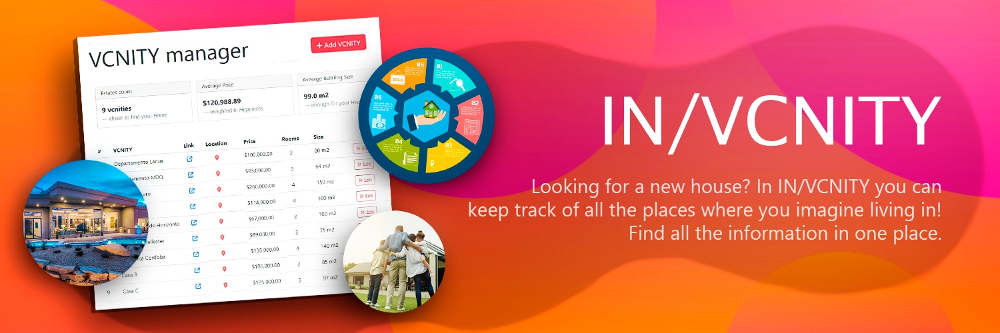
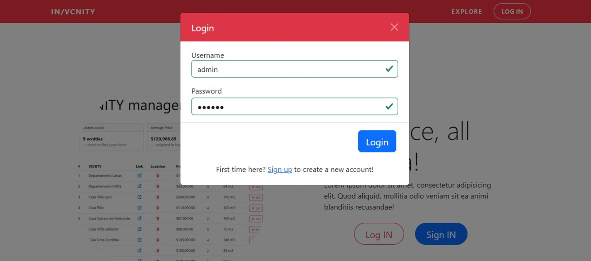
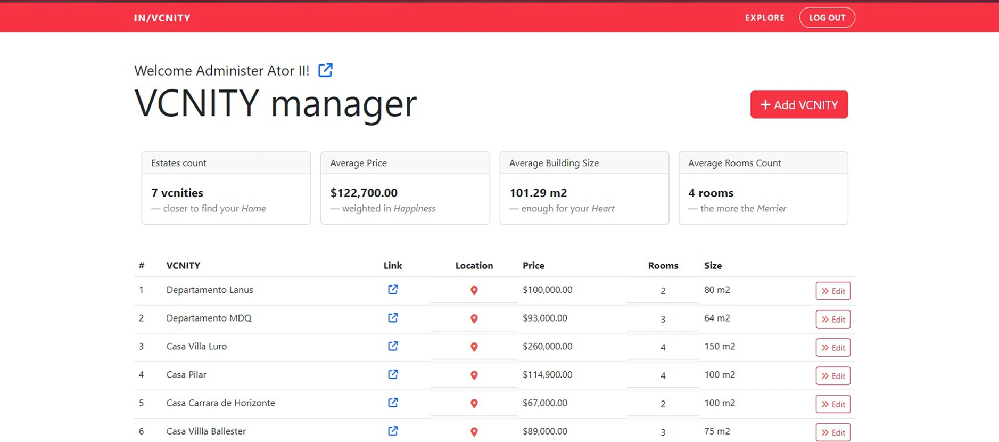
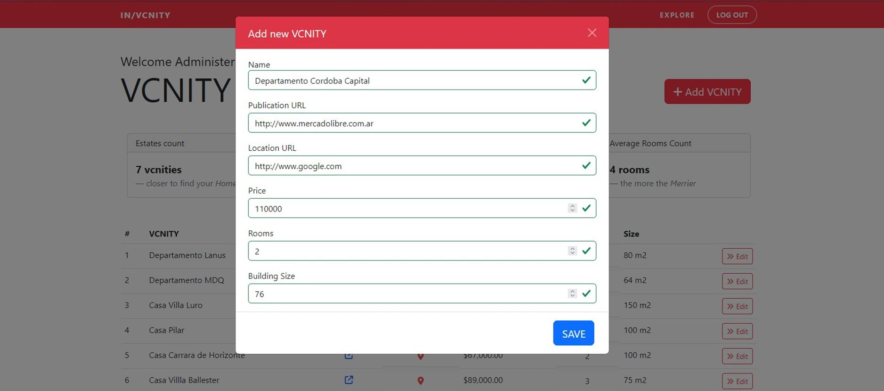
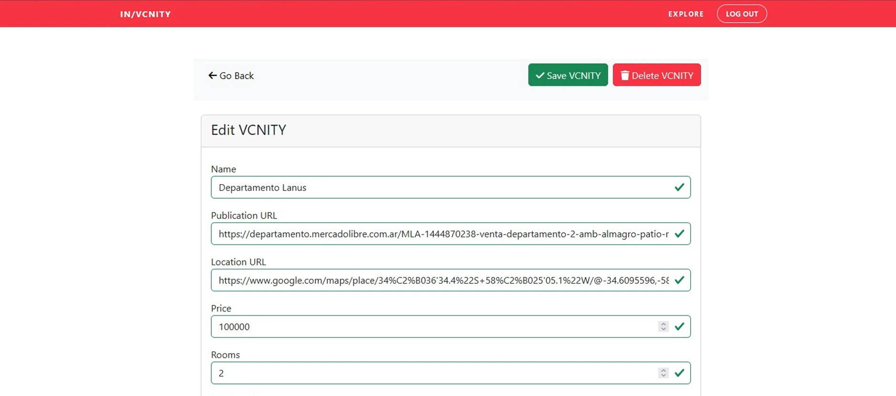

 

This simple project is an exercise of the introductory course to Java provided by <a href="https://www.buenosaires.gob.ar/educacion/codo-codo" target="_blank">"Codo a Codo 4.0"</a>. The data used for this exercise was partially created from scratch and taken from reference pages like <a href="https://mercadolibre.com" target="_blank">Mercadolibre</a>. The web design and page layout is based on the design of the free template granted by <a href="https://almundo.com.ar/paquetes-turisticos" target="_blank">Bootstrap</a>, which is also used to style the whole app.

The purpose of the exercise was to encompass all basics concepts approached by the course: Java and OOP concepts, MVC design pattern, Server Side Rendering, and data persistance with a Relational Database (MySQL).

 

<h1>Key Features.</h1>

This application...

<ul>
  <li>Login with your account or sign in and create one if haven't. You can delete your account later ;)</li>
  <li>Navigate through the IN/VCNITY Manager only if you are logged in.</li>
  <li>Add new "VCNITIES" (houses/real estate) to your IN/VCNITY Manager.</li>
  <li>Edit each VCNITY anytime you want...</li>
  <li>...or delete it!</li>
</ul>

 
<h2>Login / Create an account</h2>

The application's functionality is locked behind an authenticated session. The information added and displayed are unique to each user. The user can modify the data asoiciated to the account (username, password, name, and lastname), and can also delete the account altogether.

 
 

<h2>Display information</h2>

In the IN/VCNITY Manager displays a list with each VCNITY added by the current user. Each entry showcase information like: name, publication & location link, price, size, etc. The dashboard also shows general data about all the VCNITIES listed (average price, size, and rooms)

 
 

<h2>Add new VCNITIES!</h2>

Once authenticated the current user can start adding new VCNITIES to the list. The data persistance is handle by a Relational DB (MySQL). Note: Currently the application doesn't have programatic validation mechanisms neither client or server side, only basic HTML validation.

 
 

<h2>Edit / Delete it</h2>

The current user has control over each VCNITY entry, being able to modify all the (exposed) information or delete the entry altogether.

 

 
 
<h2>Credits</h2>
<ul>
  <li>Special thanks to <a href="#" target="_blank">Martín Márquez</a>, teacher of this course.
  <li>You can visit <a href="https://www.buenosaires.gob.ar/educacion/codo-codo" target="_blank">Codo a Codo</a> page to access list of courses.</li>
</ul>
